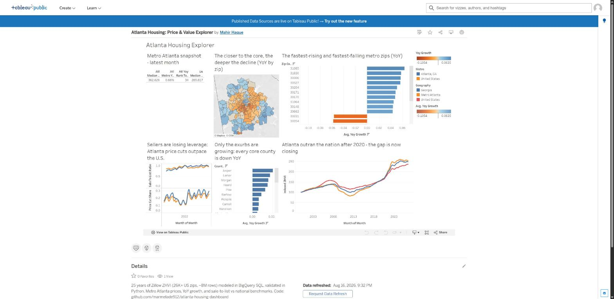

# Atlanta Housing: Price & Value Explorer

End-to-end housing analytics pipeline: 25 years of Zillow home-value data (26K+ US zip
codes, ~8M monthly observations) loaded and modeled in Google BigQuery, validated with a
Python reconciliation script, and published as an interactive Tableau Public dashboard
focused on metro Atlanta against national benchmarks.

**🔗 Live dashboard:** [Atlanta Housing: Price & Value Explorer on Tableau Public](https://public.tableau.com/app/profile/mahir.haque/viz/AtlantaHousingPriceValueExplorer/AtlantaHousingExplorer_1)

**Headline findings (Jul 2026):** metro Atlanta's median zip ZHVI (~$363K) still sits well
above the U.S. (~$290K), but the market has flipped. Every core county is down year-over-year
— DeKalb −1.5%, Fulton −1.9%, Cobb −2.0%, **Gwinnett −2.4%** (median $408K, 5.4% off its
Sep 2024 peak of $431K), Clayton −4.4% — while only the exurban ring still grows (Pike +3.1%,
Bartow +2.2%, Carroll +1.5%). Atlanta ranks 34th of the top-50 metros for YoY growth and its
price-cut share runs above the national rate: a seller's market unwinding from the inside out.

## Architecture

Zillow Research CSVs → BigQuery (`raw` → `marts` via SQL: UNPIVOT, window functions) →
CSV extracts → Python validation (`python/validate_extracts.py`) → Tableau Public.

## Data

Source: [Zillow Research](https://www.zillow.com/research/data/) public CSVs.
**Downloaded: 2026-08-16.** Zillow revises history, so re-downloads will not match exactly.

| File | Geography | Series |
|---|---|---|
| ZHVI, All Homes (SFR+Condo), smoothed, seasonally adjusted | ZIP code | monthly, 2000–present |
| Median Sale Price | Metro | monthly |
| Median List Price | Metro | monthly |
| Share of Listings With a Price Cut | Metro | monthly |

## Repo layout

- `sql/` — every BigQuery query, in run order
- `python/` — validation / reconciliation scripts
- `extracts/` — CSVs feeding Tableau (gitignored; regenerate from `sql/`)
- `data/` — raw Zillow downloads (gitignored)

## Cleaning decisions

- **Unpivot:** the ZHVI file arrives wide (26,269 zips × 319 month columns ≈ 8.38M cells).
  `python/generate_unpivot_sql.py` generates the BigQuery `UNPIVOT` IN-list from the CSV
  header — the documented pattern for ~320-column unpivots (the alternative is hand-writing
  the list). The three metro files are wide too and get the same treatment.
- **NULL cells:** UNPIVOT drops NULLs by design; 22.95% of raw cells were NULL (sparse
  early-2000s coverage), leaving **6,456,323 observations** in `marts.zhvi_long`.
- **Quality filter:** `zhvi > 10000` in `marts.stg_zhvi` drops **87 rows** (counted before
  applying).
- **Zip codes:** BigQuery autodetect types `RegionName` as INTEGER, which strips leading
  zeros from northeastern zips — restored with `LPAD(CAST(... AS STRING), 5, '0')`.
- **Metro naming:** the zip file spells the metro `Atlanta-Sandy Springs-Alpharetta, GA`
  while metro-level files use `Atlanta, GA`; flags and joins handle each form where it lives.
- **"Top-50 metros"** for the YoY rank is defined by zip count in the ZHVI data (the zip
  file's `SizeRank` ranks zips, not metros, and its metro names don't match the metro files).

## Validation

`python/validate_extracts.py`, run 2026-08-16 — all checks PASS:

| Check | Result | Detail |
|---|---|---|
| Row count `zip_growth_ga.csv` | PASS | extract 178,684 = BigQuery 178,684 |
| Row count `metro_benchmark.csv` | PASS | extract 319 = BigQuery 319 |
| Row count `spread_atl.csv` | PASS | extract 202 = BigQuery 202 |
| US median 2010-06 | PASS | pandas 153,632 vs BigQuery 153,589 (Δ 0.028%) |
| US median 2020-06 | PASS | pandas 199,145 vs BigQuery 199,136 (Δ 0.004%) |
| US median 2026-06 | PASS | pandas 289,763 vs BigQuery 289,674 (Δ 0.031%) |
| Single-month swing ≤ 60% | PASS | 0 rows flagged |
| County enrichment | PASS | 103 zips across the 11 core metro-ATL counties |

Medians reconcile pandas (exact) against BigQuery `APPROX_QUANTILES` to a 1% tolerance;
BigQuery has no aggregate `PERCENTILE_CONT`. The reconciliation recomputes from the raw
Zillow download, not the extract, so it tests the whole pipeline.

## Dashboard

Built and published entirely in **Tableau Public web authoring** (browser-based) at
1300×800, six views with finding-style titles: a KPI row (ATL median ZHVI, YoY %, top-50
metro rank, US median, latest month auto-selected on open), a metro-Atlanta zip choropleth
colored by YoY growth (diverging, centered at 0, county in tooltips), a **county ranking**
("Only the exurbs are growing") that answers "which county grew fastest?" at a glance,
top/bottom-10 zips by YoY (diverging bars via a RANK() table-calc filter), the sale-to-list
ratio + price-cut share panes (ATL vs US, shared month axis — two stacked charts instead of
a dual axis), and the indexed ZHVI trend (ATL vs GA vs US, table calculation
`SUM([zhvi]) / LOOKUP(SUM([zhvi]), FIRST()) * 100` so all three geographies share one
honest axis).

Tableau-side extracts are slimmed/pre-shaped versions of the BigQuery marts
(`zip_growth_ga_tableau.csv`, `benchmark_long.csv`, `metro_benchmark.csv`,
`spread_atl.csv`) — the benchmark medians are pivoted long in pandas so the trend chart
uses one measure + a geography dimension.
